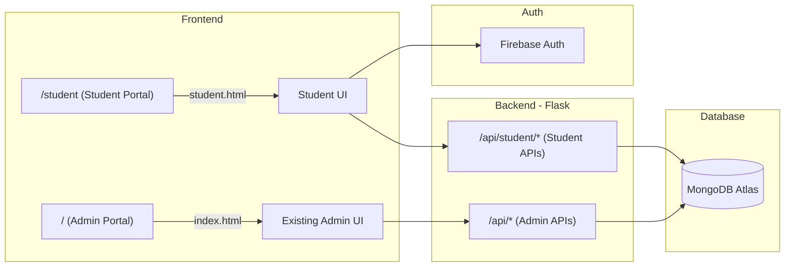

# 🎓 CampusVision Student Portal — Implementation Plan

## Overview

Add a full student-facing portal where enrolled students can log in, view their attendance history, see enrollment photos, and raise manual attendance requests — all while keeping the existing admin panel untouched at `/`.

---

## Architecture



---

## Phase 1: Firebase Auth Setup + Backend Auth Middleware

### 1.1 Firebase Project Configuration
- Use existing Firebase project or create one at [Firebase Console](https://console.firebase.google.com)
- Enable **Email/Password**, **Google Sign-In**, and **Phone Auth** providers
- Get Firebase config keys for the frontend SDK
- Download **Firebase Admin SDK service account JSON** for backend token verification

### 1.2 Backend Auth Middleware
- **File**: `backend/auth.py` (new)
- Install `firebase-admin` pip package
- Create a `@require_student_auth` decorator that:
  - Reads `Authorization: Bearer <firebase_id_token>` header
  - Verifies token via Firebase Admin SDK
  - Extracts `uid`, `email`, `phone` from the decoded token
  - Looks up student in MongoDB `students` collection by linked email
  - Attaches student info to `request.student` (Flask `g` context)
  - Returns 401 if token invalid or student not found/not linked

### 1.3 Student Account Linking (Admin-side)
- **Admin assigns email** to a student from the admin panel
- Add `email` field to student registration form in admin UI
- New field stored in `students` collection: `email` (indexed, unique)
- When student logs in with Firebase Auth, backend matches `email` → student record

### 1.4 MongoDB Schema Changes
- `students` collection gets new fields:
  ```json
  {
    "email": "student@example.com",
    "phone": "+91XXXXXXXXXX",
    "firebase_uid": "abc123...",
    "linked_at": "2026-10-08T..."
  }
  ```
- `attendance_requests` collection (new):
  ```json
  {
    "_id": "auto",
    "prn": "12345",
    "student_name": "John",
    "session": "DBMS Lecture",
    "date": "2026-10-08",
    "reason": "Face not detected due to mask",
    "status": "pending",  // pending | approved | rejected
    "created_at": "...",
    "reviewed_at": "...",
    "reviewed_by": "admin"
  }
  ```

---

## Phase 2: Student Portal Backend APIs

All student APIs require `@require_student_auth` decorator.

| Endpoint | Method | Description |
|----------|--------|-------------|
| `POST /api/student/link` | POST | First-time login: verify Firebase token, link to student record by email |
| `GET /api/student/profile` | GET | Get student profile (PRN, name, roll, branch, div, photos, enrollment date) |
| `GET /api/student/attendance` | GET | Get all attendance records for this student. Query params: `?date=`, `?month=`, `?semester=`, `?year=` |
| `GET /api/student/attendance/summary` | GET | Aggregate stats: total sessions, attended, missed, % by subject |
| `GET /api/student/attendance/calendar` | GET | Day-by-day attendance data for calendar heatmap view |
| `POST /api/student/attendance/request` | POST | Raise manual attendance request |
| `GET /api/student/attendance/requests` | GET | List student's own requests + status |
| `GET /api/student/photos` | GET | Get all enrollment face photos (center, left, right) |

### Admin-side additions:
| Endpoint | Method | Description |
|----------|--------|-------------|
| `GET /api/attendance/requests` | GET | List all pending manual attendance requests |
| `POST /api/attendance/requests/<id>/review` | POST | Approve or reject a request |

---

## Phase 3: Student Portal Frontend

### 3.1 File Structure
```
frontend/
├── student.html          (new — student portal)
├── css/
│   ├── style.css         (existing admin styles)
│   └── student.css       (new — student portal styles, same design system)
└── js/
    ├── app.js            (existing admin JS)
    └── student.js        (new — student portal JS)
```

### 3.2 Pages / Views in Student Portal

#### 🔐 Login / Sign-up Screen
- Firebase Auth UI (email/password + Google sign-in + phone)
- Clean, branded login page matching CampusVision dark theme
- First-time flow: after auth, auto-links to student record via email

#### 📊 Dashboard (Home)
- Welcome banner with student name + photo
- Quick stats cards: Total Classes, Attended, Missed, Attendance %
- Today's sessions summary
- Recent attendance activity feed

#### 📅 Attendance History
- **Day-wise view**: Calendar heatmap showing present/absent per day
- **Subject-wise view**: Breakdown by session name (subject) with counts
- **Semester/Year filter**: Filter by academic period
- Each record shows: session name, date, time, **verification snapshot**
- Click on a day to expand and see all sessions that day

#### ✋ Manual Attendance Request
- Form to raise request: select session, date, reason
- View status of past requests (pending/approved/rejected)
- Notification badge for status changes

#### 👤 Profile
- Student info: PRN, Roll No, Name, Division, Branch, Year
- **3 enrollment photos** displayed (center, left, right)
- Linked email and phone shown
- Option to update contact info

### 3.3 Design Specifications
- **Same design system** as admin: dark theme, `--primary: #3ddc97`, Hanken Grotesk font
- **Student accent color**: Slightly different shade to distinguish from admin (e.g., blue-violet `#7c5cfc`)
- Glassmorphism cards, smooth animations, responsive mobile-first layout
- **Bottom navigation** on mobile (Dashboard, Attendance, Request, Profile)
- Interactive charts for attendance stats (pure CSS/SVG, no heavy libraries)

---

## Phase 4: Admin Panel Updates

### 4.1 Student Registration Form Update
- Add **Email** field to the "Register New Student" form
- Display email column in the student table
- Email is used for Firebase Auth linking

### 4.2 Attendance Requests Management
- New **"Requests"** nav item in admin sidebar
- Table of pending requests with approve/reject buttons
- When approved: auto-insert attendance record into `attendance` collection

---

## Implementation Order

| Step | Files Modified/Created | Description |
|------|----------------------|-------------|
| **1** | `.env`, `requirements.txt` | Add Firebase Admin SDK dependency + config |
| **2** | `backend/auth.py` | Firebase Auth middleware |
| **3** | `backend/db.py` | Add indexes for new collections |
| **4** | `backend/app.py` | Add email field to student APIs + new student APIs + attendance request APIs |
| **5** | `frontend/index.html`, `frontend/js/app.js` | Add email field to admin student form |
| **6** | `frontend/css/student.css` | Student portal design system |
| **7** | `frontend/student.html` | Student portal HTML structure |
| **8** | `frontend/js/student.js` | Student portal logic + Firebase Auth |

---

## Dependencies to Install

```bash
pip install firebase-admin
```

> [!IMPORTANT]
> You will need to:
> 1. Create/use a Firebase project at [console.firebase.google.com](https://console.firebase.google.com)
> 2. Enable Email/Password, Google, and Phone sign-in methods
> 3. Download the service account JSON and place it in the backend
> 4. Add Firebase web config to `.env`

---

## Student Features Summary

| Feature | Description |
|---------|-------------|
| 🔐 **Secure Login** | Google Sign-In, email/password, phone OTP via Firebase Auth |
| 📊 **Attendance Dashboard** | Quick stats, today's summary, attendance percentage |
| 📅 **Full History** | Day-wise, subject-wise, semester/year filtering |
| 📸 **Snapshot Proof** | See face verification snapshots for each attendance mark |
| ✋ **Manual Request** | Raise attendance request if face detection failed |
| 👤 **Profile** | View enrollment photos (3 angles), personal info |
| 📱 **Mobile Responsive** | Works perfectly on phones |
| 🎨 **Premium UI** | Matches admin theme with student-specific accent |
